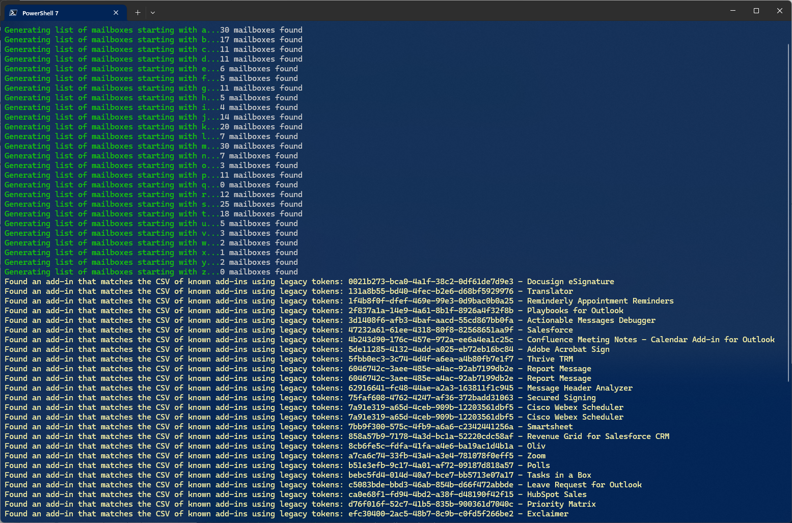

# Get-LegacyExchangeTokenAddins.ps1
Script to go through all Exchange Online mailboxes one letter at a time ("a" then "b" etc.) and gather all add-ins that these mailboxes are using, then compare them against a csv file of known addins using Exchange Legacy Tokens.

### Example syntax
```powershell
.\Get-LegacyExchangeTokenAddins.ps1 -OutputPath C:\Temp\Output\ -AddInCsvPath C:\Temp\Output\add-ins-using-exchange-tokens.csv
```


